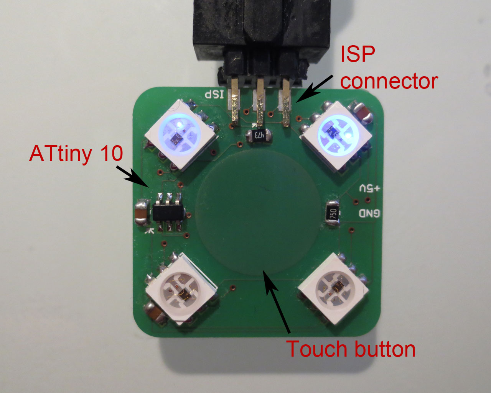
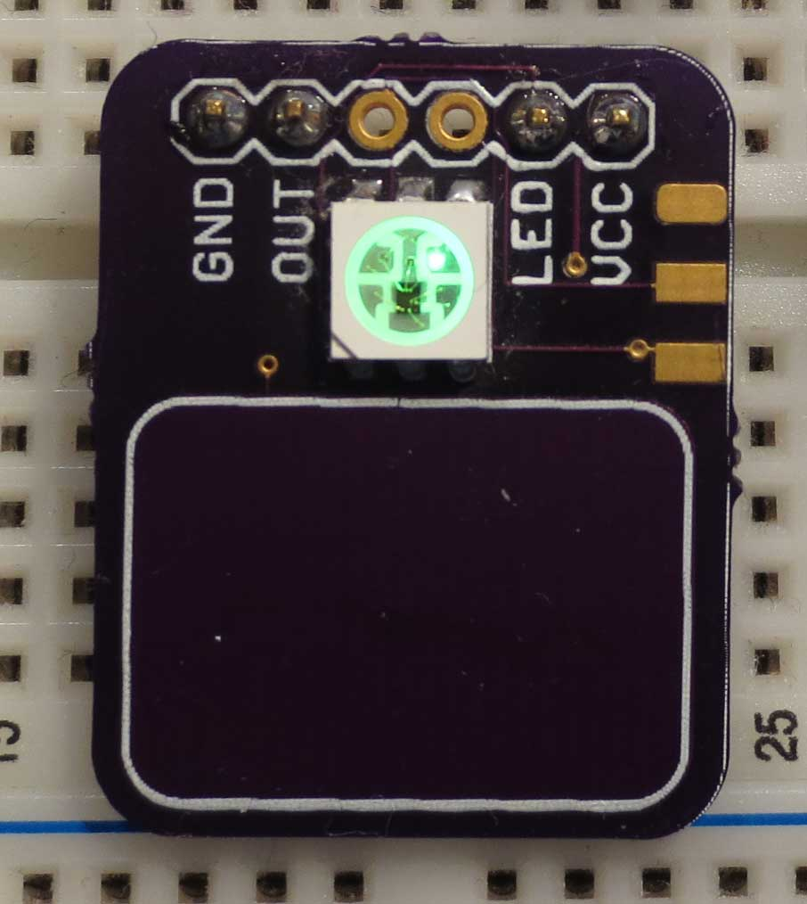
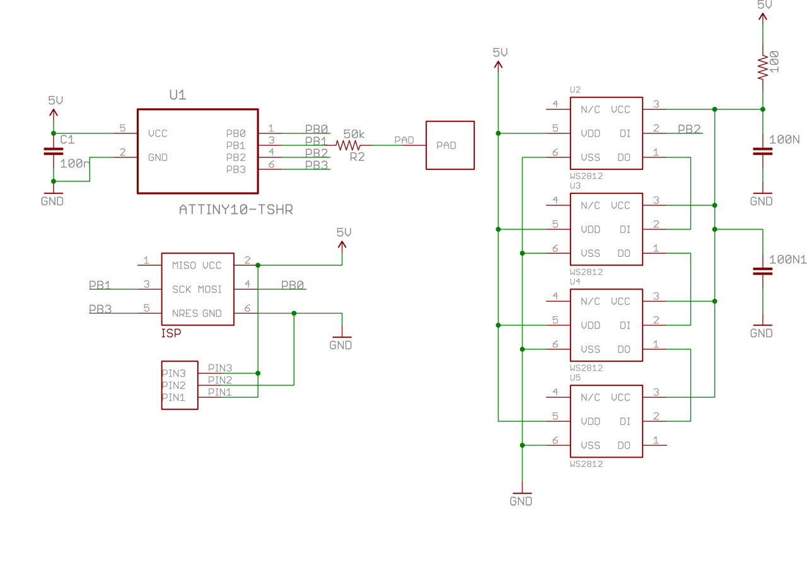

TinyTouchButton
===============

A touch controlled light with 4xWS2812 RGB LEDs and ATtiny 10

This is a small hardware project which utilizes the [light_WS2812 library](https://github.com/cpldcpu/light_ws2812) and the [TinyTouchLib](https://github.com/cpldcpu/TinyTouchLib) 
to implement a touch-button controlled RGB-LED light. Only two output pins of the ATtiny 10 
are used.

Atmel Studio project and Eagle files are included.

New: Hardware V2.0. See .

### Finished PCB V1.0 ###

### Finished PCB V2.0 ###

### Circuit ###

